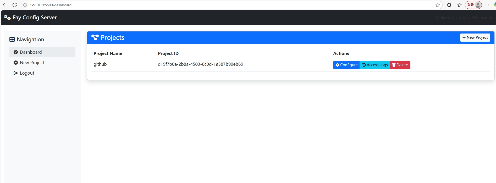

# Fay 配置管理中心

一个基于Web的配置管理工具，用于同步fay数字人开源框架项目的`system.conf`、`config.json`设置。

## 功能特点

- **Web界面管理**：通过用户友好的界面轻松管理配置文件
- **多项目支持**：管理多个项目的配置
- **备份系统**：更改前自动备份配置文件

系统提供了RESTful API接口，支持通过HTTP请求获取项目配置。所有API请求都需要通过`X-API-Key`请求头进行认证。




### 获取项目列表

```
GET /api/projects
```

**请求头：**

```
X-API-Key: your_api_key
```

**响应示例：**
```json
{
  "success": true,
  "projects": [
    {
      "id": "f9ce62c0-bb23-4090-9e29-f3817dac9cd8",
      "name": "AI助手项目",
      "description": "Fay AI助手的配置项目",
      "created_at": "2023-07-15 14:30:25"
    }
  ]
}
```

### 获取完整项目配置

```
GET /api/projects/{project_id}/config
```

**请求头：**
```
X-API-Key: your_api_key
```

**响应示例：**
```json
{
  "success": true,
  "project": {
    "id": "f9ce62c0-bb23-4090-9e29-f3817dac9cd8",
    "name": "AI助手项目",
    "description": "Fay AI助手的配置项目",
    "created_at": "2023-07-15 14:30:25"
  },
  "system_config": {
    "key": {
      "ali_nls_key_id": "your_key_id",
      "ali_nls_key_secret": "your_key_secret",
      "chat_module": "gpt_stream"
    }
  },
  "config_json": {
    "attribute": {
      "name": "菲菲",
      "gender": "女",
      "job": "助理"
    }
  }
}
```

### 获取单个配置值

```
GET /api/projects/{project_id}/config/value?key={config_key}
```

**请求头：**
```
X-API-Key: your_api_key
```

**响应示例：**
```json
{
  "success": true,
  "key": "chat_module",
  "value": "gpt_stream"
}
```

### 批量获取多个配置值

```
POST /api/projects/{project_id}/config/values
```

**请求头：**
```
X-API-Key: your_api_key
Content-Type: application/json
```

**请求体：**
```json
{
  "keys": ["chat_module", "gpt_api_key", "config.attribute.name"]
}
```

**响应示例：**
```json
{
  "success": true,
  "values": {
    "chat_module": "gpt_stream",
    "gpt_api_key": "sk-******",
    "config.attribute.name": "菲菲"
  }
}
```

## 客户端使用示例

项目的`examples`目录提供了多种使用示例：

1. `remote_project_usage.py` - 演示如何在应用中使用本地项目配置
2. `multi_project_example.py` - 演示如何管理多个项目配置
3. `remote_api_usage.py` - 演示如何通过API接口获取远程项目配置

### 远程API使用示例

```bash
# 列出所有可用项目
python examples/remote_api_usage.py --key your_api_key --action list

# 获取特定项目的完整配置
python examples/remote_api_usage.py --key your_api_key --project project_id --action config

# 演示使用远程配置进行文本转语音
python examples/remote_api_usage.py --key your_api_key --project project_id --action tts

# 演示使用远程配置进行AI对话
python examples/remote_api_usage.py --key your_api_key --project project_id --action chat
```

## 安装

1. 克隆此仓库：
   ```
   git clone https://github.com/yourusername/fay_config_server.git
   cd fay_config_server
   ```

2. 使用启动脚本（二选一）：

   Windows:
   ```
   start_server.bat
   ```

   Linux/macOS:
   ```
   chmod +x start_server.sh
   ./start_server.sh
   ```

3. 或者手动创建虚拟环境并安装依赖：
   ```
   python -m venv venv
   source venv/bin/activate  # Windows上: venv\Scripts\activate
   pip install -r requirements.txt
   python app.py
   ```

## 依赖

主要依赖项：

```
Flask==2.3.3
Werkzeug==2.3.7
cryptography==41.0.1
```

## 使用方法

1. 启动服务器：
   ```
   python app.py
   ```

2. 在浏览器中访问：`http://localhost:5500`

3. 默认登录凭据：
   - 用户名：`admin`
   - 密码：`admin`

4. 创建新项目，指定名称和配置文件路径

5. 通过Web界面编辑和管理配置

6. fay接入
fay/util/config_util.py
```
CONFIG_SERVER = {
    'BASE_URL': 'http://219.135.170.56:5500',  # 默认API服务器地址
    'API_KEY': 'your-api-key-here',       # 默认API密钥
    'PROJECT_ID': 'd19f7b0a-2b8a-4503-8c0d-1a587b90eb69'  # 项目ID，需要在使用前设置
}

```

## 安全注意事项

- 首次登录后立即更改默认管理员密码
- 生产环境中设置强`SECRET_KEY`环境变量
- 考虑使用HTTPS进行生产部署
- 加密密钥在运行时生成；为了在重启后保持持久加密，应配置固定密钥

## 项目结构

```
fay_config_server/
├── app.py                  # 主Flask应用程序
├── utils/
│   └── config_util.py      # 配置工具模块
├── templates/              # HTML模板
│   ├── base.html
│   ├── login.html
│   ├── dashboard.html
│   ├── new_project.html
│   └── project_config.html
├── projects/               # 存储项目配置的目录
├── system.conf             # 配置文件模版
├── config.json             # 配置文件模版
└── requirements.txt        # Python依赖
```

## 配置文件格式

### system.conf
标准INI风格的配置文件，带有部分和键值对：

```ini
[section_name]
key1 = value1
key2 = value2
```

### config.json
结构化的JSON配置文件：

```json
{
  "section1": {
    "key1": "value1",
    "key2": "value2"
  },
  "section2": {
    "key3": "value3"
  }
}
```

## 执照

本项目采用MIT许可证 - 详情请参见LICENSE文件。

## 致谢

- 为Fay项目构建，用于管理配置同步
